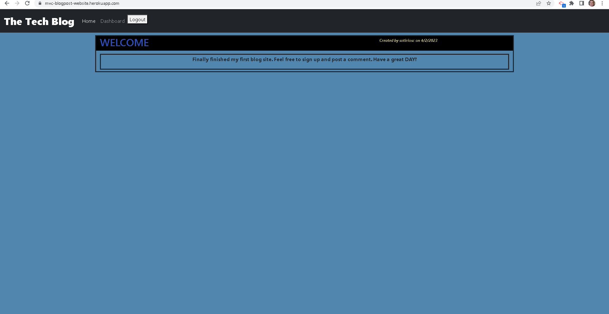

# MVC-blogpost-website

## Description

### Motivation

To build a blogpost website that I can add study notes and important things for users to track, manage and reference.

### Build

I built this project to practice and expand my MVC framework skills.

### Solve

It makes it easy to manage notes and resposibilities.

### Learn

I learned how to utilse a server, databases, models and handlebars to create dynamic webpages.

## Table of Contents:

[1. Installation](#Installation)

[2. Usage](#Usage)

[3. License](#License)

[4. Contribution](#Contribution)

[5. Tests](#Tests)

[6. Questions](#Questions)
        
## Installation:

This application does not need to be installed.

## Usage:

You must visit the website.

## License:

## Contribution:

Feel free to use and contribute to this material.

## Tests:

none

## Questions:

The source code of this project can be found on my Github repository at www.github.com/sotiriosc. Feel free to contact 
me any time regarding questions or recomendations. My email is chortogiannoss@gmail.com. Thank you for taking the time to review and use my app. 

[GitHub Profile](https://github.com/sotiriosc/MVC-blogpost-website)